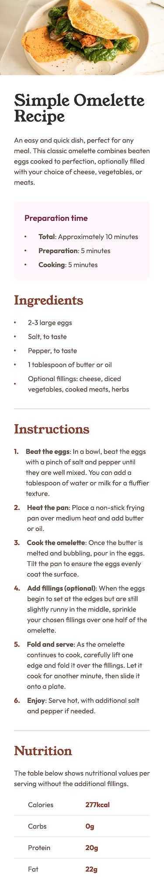
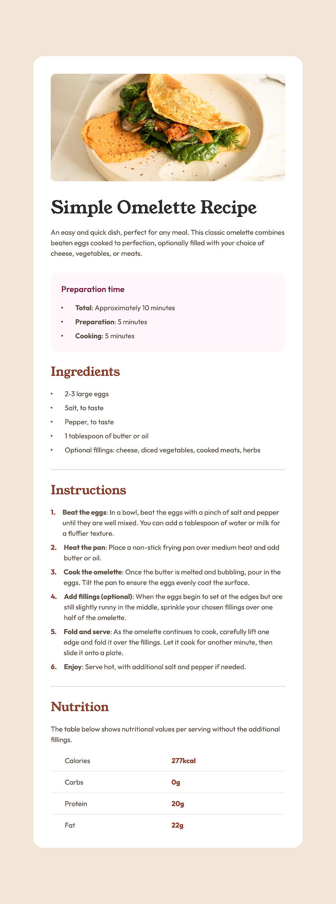

# Frontend Mentor - Recipe page solution

This is a solution to the [Recipe page challenge on Frontend Mentor](https://www.frontendmentor.io/challenges/recipe-page-KiTsR8QQKm).

## Table of contents

- [Frontend Mentor - Recipe page solution](#frontend-mentor---recipe-page-solution)
  - [Table of contents](#table-of-contents)
  - [Overview](#overview)
    - [Screenshot](#screenshot)
    - [Links](#links)
  - [My process](#my-process)
    - [Built with](#built-with)
    - [What I learned](#what-i-learned)
    - [Useful resources](#useful-resources)
  - [Author](#author)

## Overview

### Screenshot

### Links

- Solution URL: [https://github.com/chiaminchen/recipe-page](https://github.com/chiaminchen/recipe-page)
- Live Site URL: [https://chiaminchen.github.io/recipe-page/](https://chiaminchen.github.io/recipe-page/)

## My process

### Built with

- Semantic HTML5 markup
- CSS custom properties
- Flexbox
- CSS Grid
- Mobile-first workflow

### What I learned

Dynamic numbering with CSS counters. Using `counter-reset` and `counter-increment`.

### Useful resources

- [https://www.youtube.com/watch?v=tnSzkAiiQ4w&t=2s](https://www.youtube.com/watch?v=tnSzkAiiQ4w&t=2s)
- [https://developer.mozilla.org/en-US/docs/Web/CSS/Reference/Properties/counter-reset](https://developer.mozilla.org/en-US/docs/Web/CSS/Reference/Properties/counter-reset)
- [https://developer.mozilla.org/en-US/docs/Web/CSS/Reference/Properties/counter-increment](https://developer.mozilla.org/en-US/docs/Web/CSS/Reference/Properties/counter-increment)

## Author

- Website - [https://github.com/chiaminchen](https://github.com/chiaminchen)
- Frontend Mentor - [@chiaminchen](https://www.frontendmentor.io/profile/chiaminchen)
